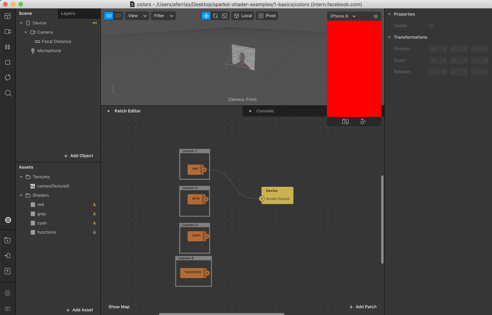

# SparkSL Shader Examples

- [SparkSL Shader Examples](#sparksl-shader-examples)
  - [Intro](#intro)
  - [Differences from GLSL](#differences-from-glsl)
    - [Vertex Shader](#vertex-shader)
    - [Namespaces](#namespaces)
    - [Swizzling](#swizzling)
    - [Optionals](#optionals)
    - [Array Notation](#array-notation)
    - [Setting Uniforms](#setting-uniforms)
    - [Sampling Textures](#sampling-textures)
    - [Auto keyword](#auto-keyword)
    - [Resolution](#resolution)
    - [FragCoords](#fragcoords)
    - [fragment() Function](#fragment-function)
  - [Contents](#contents)
    - [Basics](#basics)
      - [Color](#color)
      - [Optional-valueOr](#optional-valueor)
    - [Texture Coordinates](#texture-coordinates)
    - [Uniforms](#uniforms)
    - [Image Effects](#image-effects)
    - [3d](#3d)
    - [Builtins](#builtins)
      - [Sdf](#sdf)
  - [Converting a ShaderToy](#converting-a-shadertoy)

## Intro

This is a collection of heavily commented examples of how to write shaders in [SparkSL](https://sparkar.facebook.com/ar-studio/learn/sparksl/sparksl-overview). SparkSL is a shader language used in SparkAR that is cross compatible across iOS and android devices. It shares many similarities to GLSL but has a few quirks and nice additions of its own.

This repo closely mirrors my other project of [p5js shader examples](https://github.com/aferriss/p5jsShaderExamples).

Currently a work in progress, feel free to get in touch if you've got any questions or file a PR if you'd like to contribute.

## Differences from GLSL

For a complete list of new features in SparkSL consult the [documentation](https://sparkar.facebook.com/ar-studio/learn/sparksl/sparksl-overview).

I've outlined a few of the things I've noticed for easy reference.

### Vertex Shader

```glsl
//GLSL

// In glsl the vertex and fragment shaders are in separate files

// Vertex shader
uniform mat4 u_MVPMatrix;
attribute vec4 a_Position;
attribute vec2 a_TexCoord;
varying vec2 v_TexCoord;
void main(){
    v_TexCoord = a_TexCoord;
    gl_Position = u_MVPMatrix * a_Position;
}

// Fragment shader
varying vec2 v_TexCoord;

void main(){
    gl_FragColor = vec4(v_TexCoord, 0.0, 1.0);
}

// SparkSL

// In SparkSL, the vert and frag shaders are part of the same function

// We need to specify a position and color output for the shader
void main(out vec4 Position, out vec4 Color){

    // SparkSL has built in functions for accessing the transform matrices and vertex attributes
    Position = std::getModelViewProjectionMatrix() * std::getVertexPosition();

    // By default vertex attributes or calculations will happen in the vertex shader
    // You can force a calculation to the fragment shader by surrounding the function with fragment()
    vec2 uv = fragment(std::getVertexTexCoord());
    Color = vec4(uv, 0.0, 1.0)
}
```

### Namespaces

```glsl

// There's no such thing as namespaces in glsl

// In sparkSL you can use namespaces similar to how they work in c++

// Adding the following line means that I no longer need to write std:: before using builtin functions
using namespace std;

// You can also create your own namespaces
namespace adam {
    vec4 ferriss(vec2 uv){
        return vec4(fract(uv), 0.0, 1.0);
    }
};

vec4 main(){
    vec2 uv = fragment(getVertexTexCoord());

    return adam::ferriss(vec2(uv * 10.0));
}


```

### Swizzling

```glsl
// GLSL

// In glsl you can swizzle using rgba, xyzw, or stpq
vec4 colorA = vec4(0.1, 0.5, 0.2, 1.0);
vec4 colorB = colorA.brag; // vec4(0.2, 0.1, 1.0, 0.5);

// SparkSL

// In SparkSL you can swizzle using rgba, xyzw, stpq, as well as 0 and 1
// Swizzles work just like patch editor swizzle strings
vec4 colorA = vec4(0.1, 0.5, 0.2, 1.0);
vec4 colorB = coloA.br01; // vec4(0.2, 0.1, 0.0, 1.0);
```

### Optionals

```glsl

// This feature doesn't exist in GLSL

// In SparkSL you can use optionals so that if you don't have a texture ( or other value) attached there will be a fallback.  
// https://sparkar.facebook.com/ar-studio/learn/sparksl/sparksl-overview#optional-types
vec4 main(optional <std::Texture2d> tex0){

    vec2 uv = fragment(std::getVertexTexCoord());

    // Here we sample our optional texture
    // The valueOr function is chained on to the end so that we return red if no texture is attached
    vec4 color = tex0.sample(uv).valueOr(vec4(1.0, 0.0, 0.0, 1.0));

    return color;
}


```

### Array Notation

```glsl
// GLSL
float[] x = float[] (0.0, 0.1, 0.2, 0.3, 0.4, 0.5, 0.6);

// SparkSL

// You can do this in two ways

float arrayA[5] = {1.0, -2.0, 0.2, 5.0, 3.3};

// or...

float arrayB[3];
arrayB[0] = 0.1;
arrayB[1] = 1.9;
arrayB[2] = -1.0;


```

### Setting Uniforms

```glsl
// GLSL
// In glsl you add uniforms to the top of your script with the uniform keyword
uniform float time;

// SparkSL
// In SparkSL you create uniforms by adding them as parameters to the main function
// !!!!!!!! DANGER DANGER !!!!!!!!!
// SparkSL doesn't currently support boolean, integer, or string type uniforms. Passing them in will break spark and may crash your filter

// Time and colorA will appear as uniforms in the patch and material editors
vec4 main(float time, vec4 colorA){
    return fract(colorA + time);
}

// To set a uniform from a script you can use the material.setParameter() function
// setParameter() can take a float or R.pack2, R.pack3, or R.pack4

const M = require("Materials");
const Time = require("Time");

M.findFirst("material0).then( m => {
    m.setParameter("time", Time.ms.div(1000))
    m.setParameter("colorA", R.pack4(1.0, 0.0, 0.5, 1.0));
});

```

### Sampling Textures

```glsl

// GLSL
uniform sampler2D myTex;
varying vec2 uv;


// In glsl we pass the texture in as a sampler2D use the texture2D function to access it.

void main(){
    vec4 color = texture2D(myTex, uv);
    gl_FragColor = color;
}

// SparkSL
// In SparkSL, each texture has .sample() as part of it's member functions.
// We also need to pass in the function as a uniform via the parameters in the main function declaration
vec4 main(std::Texture2d myTex){
    vec2 uv = fragment(std::getVertexTexCoord());
    vec4 color = myTex.sample(uv) ;
    return color;
}
```

### Auto keyword

```glsl
// GLSL does not have the auto keyword

// SparkSL includes the auto keyword (similar to c++) for automatically determining variable type
auto color = vec4(1.0, 0.0, 0.2, 1.0);
```

### Resolution

```glsl
// GLSL doesn't have any builtin way to access texture or render target resolution.
// Typically they are passed in as uniforms

uniform vec2 resolution;
uniform vec2 textureSize;

// SparkSL has a couple different resolution functions
// You can access the render target size by using std::getRenderTargetSize()
// You can access a texture's size by using texture.size

vec4 main(std::Texture2d tex){
    vec2 renderTargetSize = std::getRenderTargetSize();
    vec2 textureSize = tex.size;
    // ...
}
```

### FragCoords

```glsl
//GLSL
// In glsl you can access fragment coordinates by using gl_FragCoord

uniform vec2 resolution;

void main(){
    vec2 uv = gl_FragCoord / resolution;
    gl_FragColor = vec4(uv, 0.0, 1.0);
}

// SparkSL
// In SparkSl there is currently no keyword for fragcoords.
// In a fullscreen shader you can use:

vec2 fragCoord = fragment(floor(std::getRenderTargetSize() * std::getVertexTexCoord()));

// In a non-fullscreen shader you can do:

using namespace std;
void main(out Position, out Color){
    Position = getModelViewProjectionMatrix() * getVertexPosition();

    vec2 fragCoord = fragment(Position.xy / Position.w);
    fragCoord = fragCoord * 0.5 + 0.5;

    // fragCoord is a value from 0 -1, if you want it in pixels you can do
    // fragCoord = floor(fragCoord * getRenderTargetSize());
    // if you're using pixel coordinates, you may need to add 0.5 to get the center of the pixel
    // fragCoord += 0.5;

    Color = vec4(fragCoord, 0.0, 1.0);
}
```

### fragment() Function

```glsl
using namespace std;

vec4 main(){
    // SparkSL will try to move all calculation that it can into the vertex shader for increased performance.
    // Sometimes this isn't desirable so you can force a calculation in the fragment shader with the fragment() function.
    // All subsequent calculation after calling a fragment() function on a variable will have in the fragment shader.

    // Output one of the following and note the slight difference in appearance
    vec2 vertexUvs = getVertexTexCoord();
    vec2 fragmentUvs = fragment(getVertexTexCoord());

    return vec4(vertexUvs, 0.0, 1.0);
}
```

## Contents



Each project contains a spark file with a few different example shaders contained within. Just open up the patch editor and connect the output of the shader assets to the Device Output patch to try different effects.

### Basics

#### Color

This project shows how to create a shader code asset and render a few different colors.

- Red
- Gray
- Cyan
- Functions

#### Optional-valueOr

This project shows how to use the `optional` keyword and `valueOr()` fallback function.

### Texture Coordinates

This project shows how to access texture coordinates and use them in a variety of different ways

- Basic Uvs
- Tiles
- Gradient
- Random
- Noise
- Checkers
- Vignette

### Uniforms

This project shows how to send values to a shader from the patch / material editors, as well as from a script.

- Uniforms Basics
- Touch Position
- From Script
- Textures

### Image Effects

- Adjust HSV
- Box Blur
- Displacement Map
- Gaussian Blur
- Mirror
- Pixel Stretch
- Sine Distort
- Invert
- Mosaic
- RGB Separation
- Convolution
- Delay
- Feeback
- Slitscan

### 3d

- Matcap
- Glass
- Vertex Displacement
- Fresnel (Facing ratio)
- Outline

### Builtins

This section shows how to use the built in libraries

#### Sdf

- Basic Shapes
- Rotation
- Complex Shapes
- Annular Shapes

## Converting a ShaderToy

Many of the functions in [shadertoy](https://www.shadertoy.com/) have SparkSL equivalents. Here's a table with some of them listed out. Some things like delta time, date, and mouse position are not listed here. However they could be computed and passed as uniforms to your shader.

| Shadertoy                | SparkSL                    |
| ------------------------ | -------------------------- |
| iTime                    | std::getTime()             |
| iResolution.xy           | std::getRenderTargetSize() |
| iChannelResolution[0].xy | texture.size               |
| fragCoord                | [see above](#FragCoords)   |
| texture()                | myTex.sample(uv)           |
